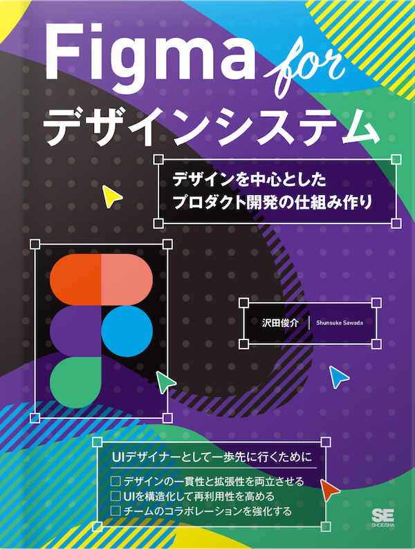

Figma 디자인 시스템
=====

디자인을 중심으로 한 제품 개발 구조 만들기

## 1장 디자인 시스템을 알자

### 작례 파일

[Design System Starting Point](https://www.figma.com/community/file/1452169657370831590/)

### 참고 링크

- Mterial Design: Google: [https://m3.material.io/](https://m3.material.io/)
- Human Interface Guidelines(Apple): [https://developer.apple.com/design/human-interface-guidelines/](https://developer.apple.com/design/human-interface-guidelines/)
- Atlassian Design System: [https://atlassian.design/](https://atlassian.design/)
- Primer(GitHub): [https://primer.style/](https://primer.style/)
- 블록 박스와 인라인 박스: [https://codepen.io/Moses-Kim/pen/JjQqdwq/](https://codepen.io/Moses-Kim/pen/JjQqdwq/)

## 2장 전문적인 Figma

### 참고 링크

- Google Sheets Sync: [https://www.figma.com/community/plugin/735770583268406934/](https://www.figma.com/community/plugin/735770583268406934/)
- Ratios: [https://www.figma.com/community/plugin/977155744958829960/](https://www.figma.com/community/plugin/977155744958829960/)
- Airbnb JavaScript: [https://airbnb.io/javascript/react/#naming/](https://airbnb.io/javascript/react/#naming/)
- Anima - Figma to Code: [https://www.figma.com/community/plugin/857346721138427857](https://www.figma.com/community/plugin/857346721138427857/)

## 3장 디자인 시스템을 시작하자

### 작례 파일

[Web Design Example](https://www.figma.com/community/file/1452170252538242793/)

### 참고 링크

- Color Shades: [https://www.figma.com/community/plugin/929607085343688745/](https://www.figma.com/community/plugin/929607085343688745/)
- Color Designer: [https://www.figma.com/community/plugin/739475857305927370/](https://www.figma.com/community/plugin/739475857305927370/)
- Adobe Color: [https://color.adobe.com/create/color-wheel](https://color.adobe.com/create/color-wheel)
- Color wheel palette generator: [https://www.figma.com/community/plugin/1286792998372727741/](https://www.figma.com/community/plugin/1286792998372727741/)
- Contrast Grid: [https://www.figma.com/community/plugin/993414361395505148/](https://www.figma.com/community/plugin/993414361395505148/)
- WCAG 2.1(영어): [https://www.w3.org/TR/WCAG21/](https://www.w3.org/TR/WCAG21/)
- WCAG 2.1(한국어): [http://www.kwacc.or.kr/WAI/wcag21/](http://www.kwacc.or.kr/WAI/wcag21/)

### 샘플 파일

- [Design System 3-3](https://www.figma.com/design/h1cTqgSSxOJki4k7tOfYCN/Design-System-3-3)
- [Design System 3-4](https://www.figma.com/design/cISSZ9N1grYhkPefp9XJYQ/Design-System-3-4)

## 4장 디자인 토큰

### 참고 링크

- Variable Color Style Guide: [https://www.figma.com/community/plugin/1270740078273146018/](https://www.figma.com/community/plugin/1270740078273146018/)
- Unsplash: [https://www.figma.com/community/plugin/738454987945972471/](https://www.figma.com/community/plugin/738454987945972471/)

### 샘플 파일

- [Design System 4-1](https://www.figma.com/design/PHZa113O4HqJlCpmoyMqF7/Design-System-4-1)
- [Design System 4-2](https://www.figma.com/design/UI02avKctu9ofEqLbMZ7zh/Design-System-4-2)
- [Design System 4-3](https://www.figma.com/design/TPut2KBVp1WJXS1x6cuLUM/Design-System-4-3)
- [Design System 4-4-1](https://www.figma.com/design/trIxOpFZ8WjyT3SNgMZeFb/Design-System-4-4-1)
- [Design System 4-4-2](https://www.figma.com/design/9o3povQLsMqKsxwBdiZLyi/Design-System-4-4-2)
- [Web Design 4-3](https://www.figma.com/design/sHkeYSEJ9IhrFESY0W6N8A/Web-Design-4-3)
- [Web Design 4-4-1](https://www.figma.com/design/xH4kmNxnVa4cZFtoHHZfak/Web-Design-4-4-1)
- [Web Design 4-4-2](https://www.figma.com/design/WftPGwajmWQXyEVnTccvAF/Web-Design-4-4-2)

## 5장 타이포그래피

### 참고 링크
- Google Fonts: [https://fonts.google.com/](https://fonts.google.com/)
- Typescales: [https://www.figma.com/community/plugin/739825414752646970/](https://www.figma.com/community/plugin/739825414752646970/)
- 줄 간격을 둘러싼 모험: [https://www.figma.com/blog/line-height-changes/](https://www.figma.com/blog/line-height-changes/)
- Variables to Frames: [https://www.figma.com/community/plugin/1289612698854208114/](https://www.figma.com/community/plugin/1289612698854208114/)

### 샘플 파일

- [Design System 5-3](https://www.figma.com/design/jaAz95xozQq4KSGbj8agr6/Design-System-5-3)
- [Web Design 5-3](https://www.figma.com/design/xpB9qIKnBboPAcZpjAUnq1/Web-Design-5-3)

## 6장 디자인 시스템 확충

### 참고 링크

- Material Symbols: [https://www.figma.com/community/plugin/1088610476491668236/](https://www.figma.com/community/plugin/1088610476491668236/)

### 샘플 파일

- [Design System 6-1](https://www.figma.com/design/jT5ZRzJ19Ywv5FeBj3uWUi/Design-System-6-1)
- [Design System 6-2](https://www.figma.com/design/fDKcaG6J7552G5I6hHNpgM/Design-System-6-2)
- [Design System 6-4](https://www.figma.com/design/YYoCGCUMRSlEXj8vgBGWrj/Design-System-6-4)

## 7장 패턴 라이브러리

### 참고 링크

- Bootstrap 브레이크포인트: [https://getbootstrap.kr/docs/5.3/layout/breakpoints/](https://getbootstrap.kr/docs/5.3/layout/breakpoints/)
- EightShapes Specs: [https://www.figma.com/community/plugin/1205622541257680763/](https://www.figma.com/community/plugin/1205622541257680763/)

### 샘플 파일

- [Design System 7-1](https://www.figma.com/design/kUj5Y6Crj5xBrcnJ6LpV6S/Design-System-7-1)
- [Design System 7-2](https://www.figma.com/design/lLWU0vh5JNydQmfyKfNl4E/Design-System-7-2)
- [Design System 7-4](https://www.figma.com/design/mlkmbhJCrjDIiUtGLxfCwO/Design-System-7-4)
- [Web Design 7-2](https://www.figma.com/design/zW4hlSOnOK2Fi0mz8f2ttm/Web-Design-7-2)
- [Web Design 7-4](https://www.figma.com/design/XcXzukqdJQE1tOJLhBoLeP/Web-Design-7-4)

## 8장 구현 코드와의 연동

### 참고 링크

- Export Filtered Variables: [https://www.figma.com/community/plugin/1255198963912190091/](https://www.figma.com/community/plugin/1255198963912190091/)
- Style Dictionary: [https://amzn.github.io/style-dictionary/](https://amzn.github.io/style-dictionary/)
- variable2css: [https://www.figma.com/community/plugin/1261234393153346915/](https://www.figma.com/community/plugin/1261234393153346915/)
- Variables Converter: [https://www.figma.com/community/plugin/1256000104406722117/](https://www.figma.com/community/plugin/1256000104406722117/)
- Storybook: [https://storybook.js.org/](https://storybook.js.org/)
- Netlify: [https://www.netlify.com/](https://www.netlify.com/)
- Chromatic: [https://www.chromatic.com/](https://www.chromatic.com/)

## 기타

- Figma 업데이트 정보: [https://www.figma.com/ko-kr/release-notes/](https://www.figma.com/ko-kr/release-notes/)
- 이미지 라이선스: [https://unsplash.com/license/](https://unsplash.com/license/)
- 저자 온라인 강좌: [https://www.udemy.com/user/shunsuke-sawada/](https://www.udemy.com/user/shunsuke-sawada/)
